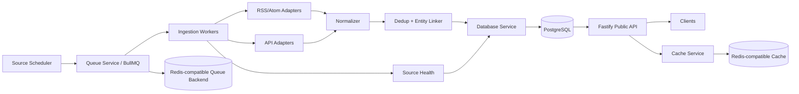

# 03 — System Design

## 1. Architecture



应用层只依赖 Database/Queue/Cache 接口，不应知道 PostgreSQL 或 Redis 是本地容器、远程服务器还是托管服务。

## 2. Services

MVP 推荐单仓 monorepo、逻辑模块化，不拆微服务：

- `api`: Public REST API
- `worker`: ingestion jobs
- `scheduler`: recurring job producer
- `core`: domain/normalization/matching
- `adapters`: source adapters
- `db`: schema/repositories/migrations/database factory
- `queue`: BullMQ queue/worker connection abstraction
- `cache`: API/cache abstraction
- `observability`: metrics/logging/health

部署时至少有两个独立进程：`api` 与 `worker`。scheduler 可跟 worker 一起运行，但必须保证 leader/unique job，避免重复计划。

## 3. Repository Layout

```text
/apps/api
/apps/worker
/packages/core
/packages/db
  /config
  /repositories
  /migrations
/packages/queue
/packages/cache
/packages/adapters
/packages/config
/packages/observability
/contracts/openapi.yaml
/docs
/tests/fixtures
```

## 4. Technology Decision

- TypeScript strict：所有 source payload 在边界完成 runtime validation。
- Fastify：低开销、JSON API、插件化。
- PostgreSQL：强约束、JSONB、trigram、事务、成熟运维。
- Redis + BullMQ：source job、重试、限流、scheduler；Redis 是 operational datastore，不是 canonical datastore。
- Zod：API/adapter payload validation。
- fast-xml-parser（或同级库）：RSS/Atom；更换需 ADR。
- Drizzle/SQL migration：模型可见、避免 ORM 隐式行为。

## 5. Infrastructure Portability

### 5.1 Deployment modes

同一应用镜像必须支持：

```text
A. Local development
Docker Compose
├─ api
├─ worker
├─ postgres
└─ redis

B. Single server
Container runtime
├─ api
├─ worker
├─ postgres + persistent volume
└─ redis + persistence

C. Split / managed production
Application host
├─ api
└─ worker
    ├─ remote/managed PostgreSQL
    └─ remote/managed Redis
```

应用切换 A/B/C 只能修改环境变量/Secret，不得修改业务代码。

### 5.2 Configuration boundary

禁止业务代码硬编码：

- `localhost`
- Docker service names，例如 `postgres` / `redis`
- 固定 IP
- 特定云厂商 hostname
- production/development hostname 分支

只允许通过配置获得连接参数。

### 5.3 PostgreSQL interaction layer

所有数据库连接必须通过：

```text
Config
  ↓
createDatabase(config)
  ↓
Pool / Driver
  ↓
Repository
  ↓
Application Service
```

Repository 与业务层不得自行 `new Pool()` 或读取 `DATABASE_URL`。

Database config 至少支持：

- URL
- pool max
- connect timeout
- idle timeout
- statement timeout
- TLS mode
- CA path / platform secret injection

Migration 是独立部署步骤：

```text
deploy
  ↓
db:migrate
  ↓
start api
  ↓
start worker
```

API/Worker 启动路径不得自动竞争执行 migration。

### 5.4 Queue and Cache interaction layer

Queue 与 Cache 在逻辑上分离：

```text
packages/queue
├─ connection
├─ queues
├─ workers
└─ scheduler

packages/cache
├─ cache interface
└─ redis implementation
```

业务模块不得直接创建 Redis client，不得读取/修改 BullMQ 私有 key。

BullMQ key namespace 使用 BullMQ 自身的 `prefix`；不得依赖 ioredis `keyPrefix`。

Queue producer 与 Worker 可以共享连接配置来源，但重试/断线策略允许不同：

- 前台 enqueue 路径应有限等待并快速暴露不可用。
- 后台 worker 可持续等待 queue backend 恢复。

### 5.5 Redis durability model

PostgreSQL 是 canonical datastore。

Redis 保存：

- BullMQ waiting/delayed/retry/job metadata
- transient cache
- coordination state

Redis 丢失不得造成 canonical anime/news 数据丢失，但可能造成排队任务状态丢失，因此生产 queue backend SHOULD 启用持久化，并禁止通过普通内存淘汰策略删除队列 key。

任何需要永久保存的 source cursor、health history、canonical data 不得只存在 Redis。

## 6. Ingestion Flow

1. Scheduler 根据 `source.poll_interval` 产生 `ingest-source` job。
2. Worker 加载 Source Registry。
3. 检查 enabled / legal gate / circuit breaker。
4. 获取 cursor/ETag/Last-Modified。
5. Adapter 请求上游。
6. 对 raw payload 进行 schema validation。
7. 生成 normalized DTO。
8. 计算 source-native unique key 与 content fingerprint。
9. 事务写入：raw metadata → canonical record → relation/provenance。
10. 触发 entity linking。
11. 更新 `source_health` / `ingest_run`。
12. 失败时按错误类别 retry/backoff；不得无界重试。

## 7. Error Classes

- `AUTH_ERROR`: 401/403，停止重试并告警。
- `RATE_LIMIT`: 429，按 Retry-After。
- `UPSTREAM_5XX`: 有限指数退避。
- `NETWORK_TIMEOUT`: 有限指数退避。
- `SCHEMA_DRIFT`: 保存最小诊断信息，禁用该 source 或进入 degraded。
- `LEGAL_DISABLED`: 不请求上游。
- `PERMANENT_4XX`: 不自动重试。

## 8. Caching

- Public list/detail response 可 Redis cache 30–120 秒。
- Cache 层必须允许故障降级：cache backend 不可用时 API SHOULD 回退 PostgreSQL，而不是因纯缓存故障整体 503。
- 上游 API cache 必须遵守 source policy。
- AniList 不允许做“数据仓库式缓存”；只能做短 TTL、按需。
- RSS feed 的 ETag/Last-Modified 等持久 cursor 存 PostgreSQL；Redis 可缓存但不能成为唯一副本。

## 9. Consistency

采用最终一致：

- source ingest 提交 canonical record 后立即可查。
- entity linking 可以异步补关联。
- API 必须允许 `anime_ids=[]`，不能因匹配未完成而阻塞新闻入库。

## 10. Security Boundary

- 上游 tokens 仅 worker 可访问。
- Public API 不暴露 upstream credentials、raw auth headers、内部 stack trace。
- 数据库/Redis TLS、证书与密码只从配置/Secret 注入。
- 管理操作（enable/disable source、manual ingest）MVP 可先仅 CLI/DB 配置，不开放公网 admin API。

## 11. Future Crawler Extension

Phase 2 通过相同 `SourceAdapter` interface 扩展 `CRAWLER`；Crawler 必须运行在单独 worker queue 和更严格并发/robots/ToS policy 下，不能污染 P1 RSS/API worker。
