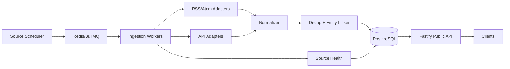

# 03 — System Design

## 1. Architecture



## 2. Services

MVP 推荐单仓 monorepo、逻辑模块化，不拆微服务：

- `api`: Public REST API
- `worker`: ingestion jobs
- `scheduler`: recurring job producer
- `core`: domain/normalization/matching
- `adapters`: source adapters
- `db`: schema/repositories/migrations
- `observability`: metrics/logging/health

部署时可以是两个进程：`api` 与 `worker`。scheduler 可跟 worker 一起运行，但必须保证 leader/unique job，避免重复计划。

## 3. Repository Layout

```text
/apps/api
/apps/worker
/packages/core
/packages/db
/packages/adapters
/packages/config
/packages/observability
/contracts/openapi.yaml
/docs
/tests/fixtures
```

## 4. Technology Decision

- TypeScript strict：所有 source payload 在边界完成 runtime validation。
- Fastify：低开销、JSON API、插件化。
- PostgreSQL：强约束、JSONB、trigram、事务、成熟运维。
- Redis + BullMQ：source job、重试、限流、scheduler。
- Zod：API/adapter payload validation。
- fast-xml-parser（或同级库）：RSS/Atom；更换需 ADR。
- Drizzle/SQL migration：模型可见、避免 ORM 隐式行为。

## 5. Ingestion Flow

1. Scheduler 根据 `source.poll_interval` 产生 `ingest-source` job。
2. Worker 加载 Source Registry。
3. 检查 enabled / legal gate / circuit breaker。
4. 获取 cursor/ETag/Last-Modified。
5. Adapter 请求上游。
6. 对 raw payload 进行 schema validation。
7. 生成 normalized DTO。
8. 计算 source-native unique key 与 content fingerprint。
9. 事务写入：raw metadata → canonical record → relation/provenance。
10. 触发 entity linking。
11. 更新 `source_health` / `ingest_run`。
12. 失败时按错误类别 retry/backoff；不得无界重试。

## 6. Error Classes

- `AUTH_ERROR`: 401/403，停止重试并告警。
- `RATE_LIMIT`: 429，按 Retry-After。
- `UPSTREAM_5XX`: 有限指数退避。
- `NETWORK_TIMEOUT`: 有限指数退避。
- `SCHEMA_DRIFT`: 保存最小诊断信息，禁用该 source 或进入 degraded。
- `LEGAL_DISABLED`: 不请求上游。
- `PERMANENT_4XX`: 不自动重试。

## 7. Caching

- Public list/detail response 可 Redis cache 30–120 秒。
- 上游 API cache 必须遵守 source policy。
- AniList 不允许做“数据仓库式缓存”；只能做短 TTL、按需。
- RSS feed 可以保存 ETag/Last-Modified 与 item hash。

## 8. Consistency

采用最终一致：

- source ingest 提交 canonical record 后立即可查。
- entity linking 可以异步补关联。
- API 必须允许 `anime_ids=[]`，不能因匹配未完成而阻塞新闻入库。

## 9. Security Boundary

- 上游 tokens 仅 worker 可访问。
- Public API 不暴露 upstream credentials、raw auth headers、内部 stack trace。
- 管理操作（enable/disable source、manual ingest）MVP 可先仅 CLI/DB 配置，不开放公网 admin API。

## 10. Future Crawler Extension

Phase 2 通过相同 `SourceAdapter` interface 扩展 `CRAWLER`；Crawler 必须运行在单独 worker queue 和更严格并发/robots/ToS policy 下，不能污染 P1 RSS/API worker。
